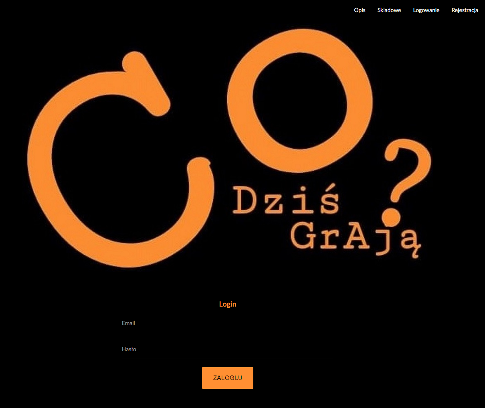
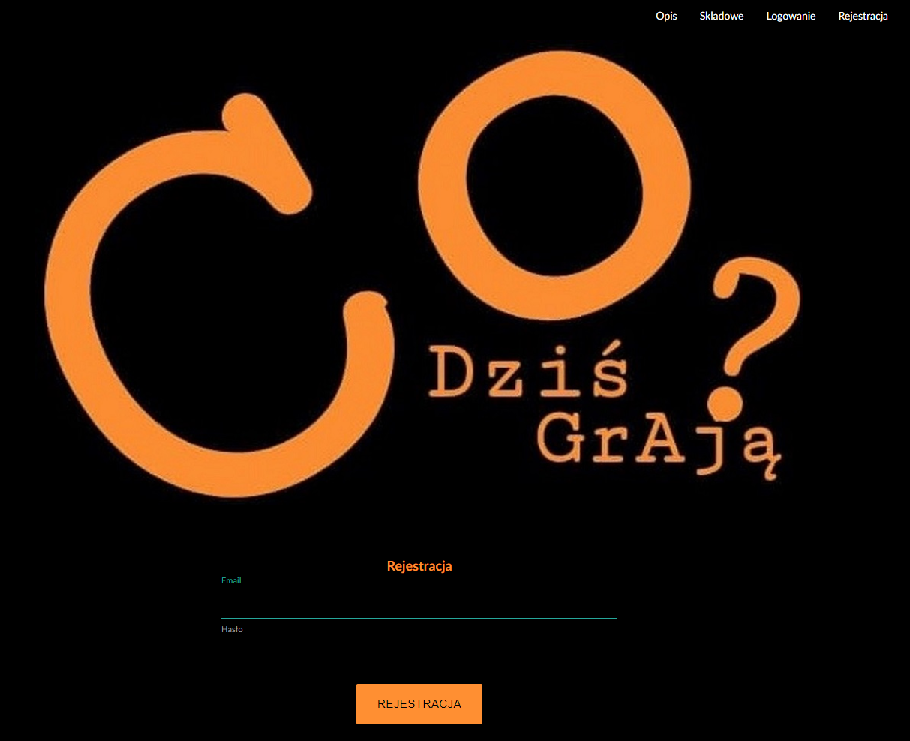
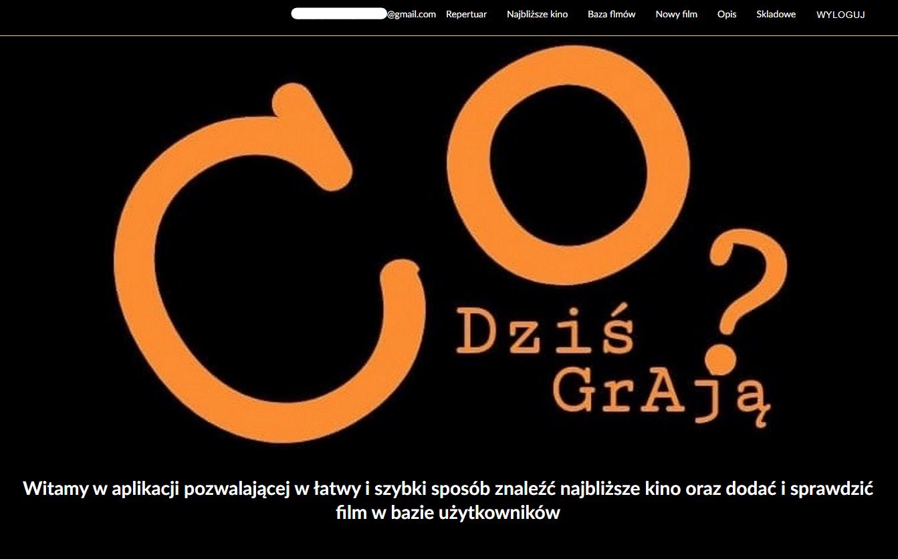
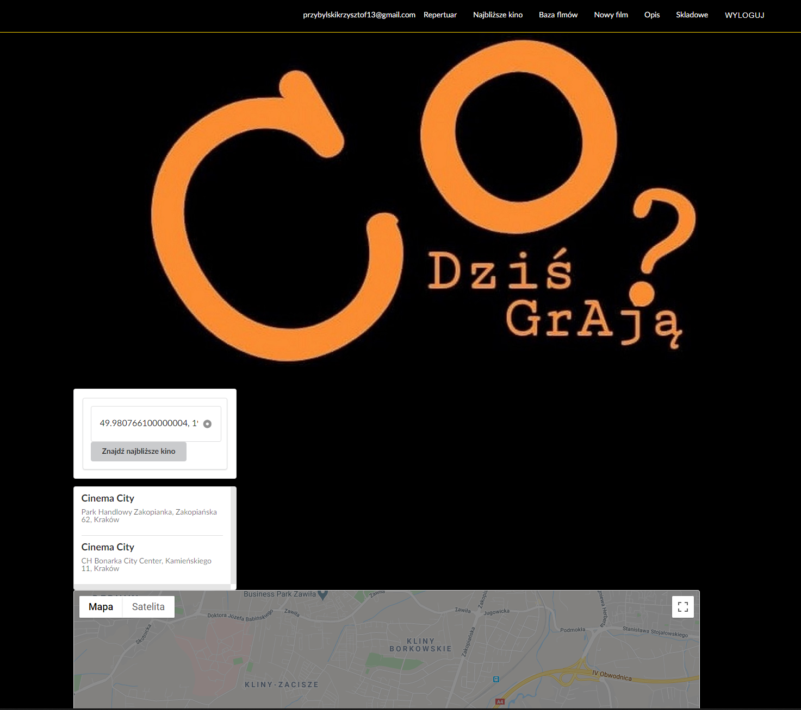
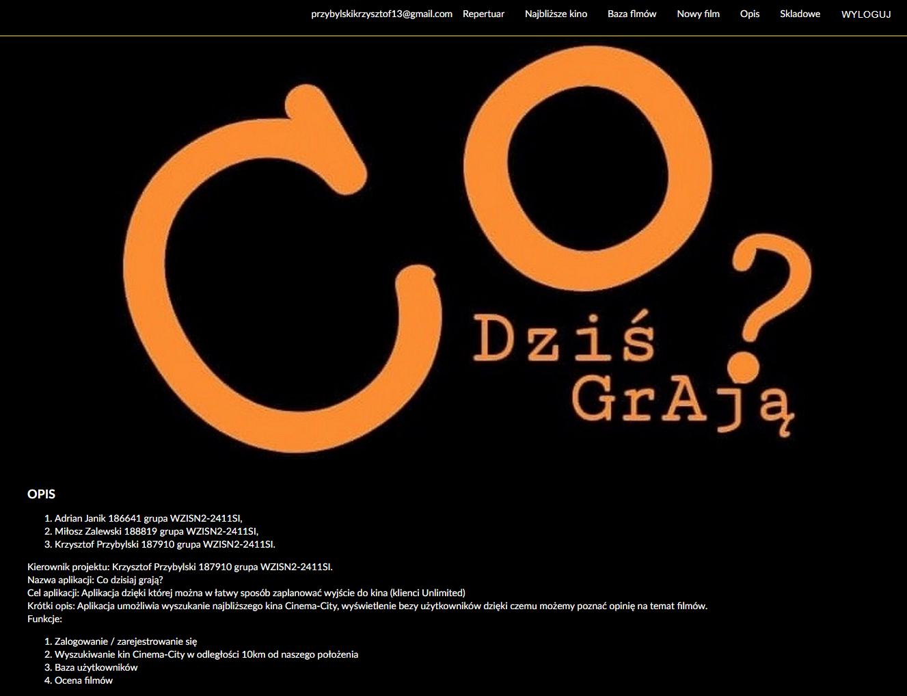
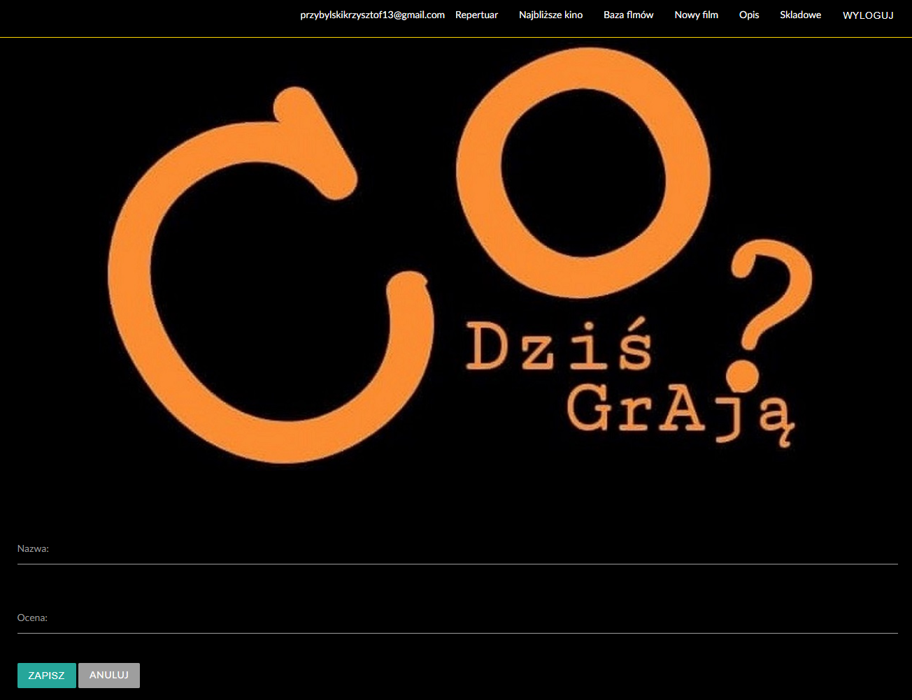
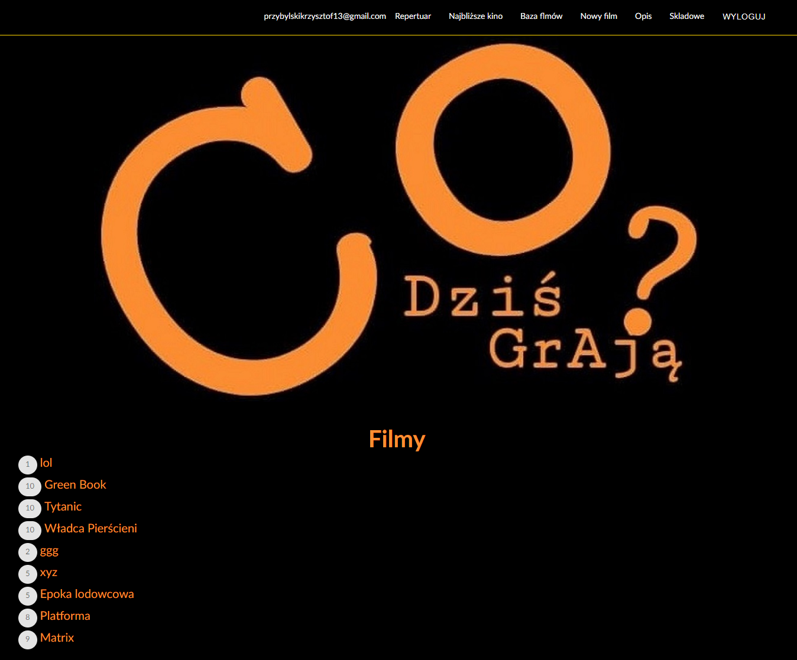

## Witamy na stronie projektu Co dzis graja

Aplikacja Co dzis grają powstała w ramach przedmiotu Bogate Aplikacje Internetowe pod opieką doktora Janusza Stala.

### Co dzis grają?

Aplikacja umożliwia kinomanowi sprawdzenie lokalizacji najbliższych kin oraz ocenę filmów.
Program jest obsługiwany przez przeglądarki internetowe na komputerach osobistych oraz urządzaniach mobilnych.

W aplikacji jest możliwość stworzenie konta.
Do poprawnego działania wymagane jest udostępnienie Lokalizacji.

Aplikacja powstwała z wykorzystaniem technologii html, css, JavaScript, Vue.js oraz API, który pozwala zdobyć repertuar kin.

## Pierwszy zrzut programu w przeglądarce internetowej.

Przedstawione jest logowanie do strony.
Jeżeli nie posiadamy konta, w prawym górnym rogu strony znajduje sie przycisk do rejestracji konta.

## Okno rejestracji

Po przejściu rejestracji, widać pola które wymagają wpisania adresu e-mail i hasła do konta.

## Strona początkowa aplikacji po zalogowaniu

## Lokalizowanie najbliższego kina z wykorzystaniem sygnału GPS

Po przejściu do Najbliższe kino wyświetla się poniższy widok i po kliknięciu w Znajdź najbliższe kino, strona zczytuje za pomocą sygnału GPS naszą lokalizację i API wyświetla najbliższe kina.

## Opis strony

W opisie strony znajdują się dane twórców i cel projektów.

## Dodanie oceny filmu

Na screenie pokazane jest strona dodawania oceny o filmie

## Baza filmów

Zrzut okazuje bazę obejrzanych przez użytkownika filmów i ich ocenę

## Składowe projektu
Aktywny link do zgłoszenia projektu (link do postu, w którym projekt został zgłoszony)
https://e-uczelnia.uek.krakow.pl/mod/forum/discuss.php?d=129539

Aktywny link do wykonanej aplikacji na serwerze Wizard
https://gravoos.github.io

Aktywny link do repozytorium projektu na GitHub
https://github.com/Gravoos/Gravoos.github.io

Aktywny link do witryny internetowej projektu na GitHub
ogryz.github.io/Co_dzis_graja/

Aktywny link do zarządzania projektem informatycznym na GitHub
https://github.com/Gravoos/Gravoos.github.io/projects/1
