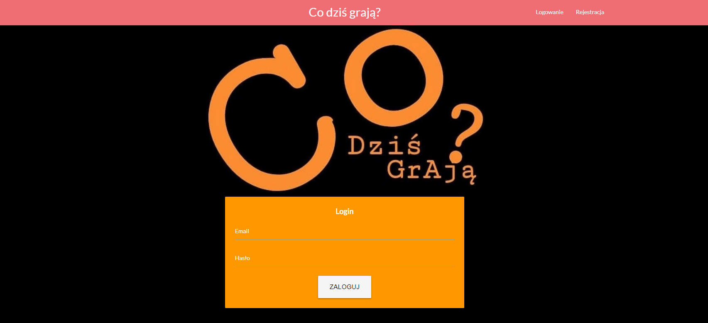

## Witamy na stronie projektu Co dzis graja

Aplikacja Co dzis grają powstała w ramach przedmiotu Bogate Aplikacje Internetowe pod opieką doktora Janusza Stala.

### Co dzis grają?

Aplikacja umożliwia kinomanowi sprawdzenie repeturaru najbliższych kin w jego położeniu.
Program jest obsługiwany przez przeglądarki internetowe na komputerach osobistych oraz urządzaniach mobilnych.

W aplikacji jest możliwość stworzenie konta
Do poprawnego działania wymagane jest udostępnienie Lokalizacji.

Aplikacja powstwała z wykorzystaniem technologii html, css, JavaScript, Vue.js oraz API, który pozwala zdobyć repertuar kin.

## Pierwszy zrzut programu w przeglądarce internetowej.

Przedstawione jest logowanie do strony.
Jeżeli nie posiadamy konta, w prawym górnym rogu strony znajduje sie przycisk do rejestracji konta.

## Okno rejestracji

Po przejściu rejestracji, widać pola które wymgają wpisania adresu E-mail i hasła do konta.

